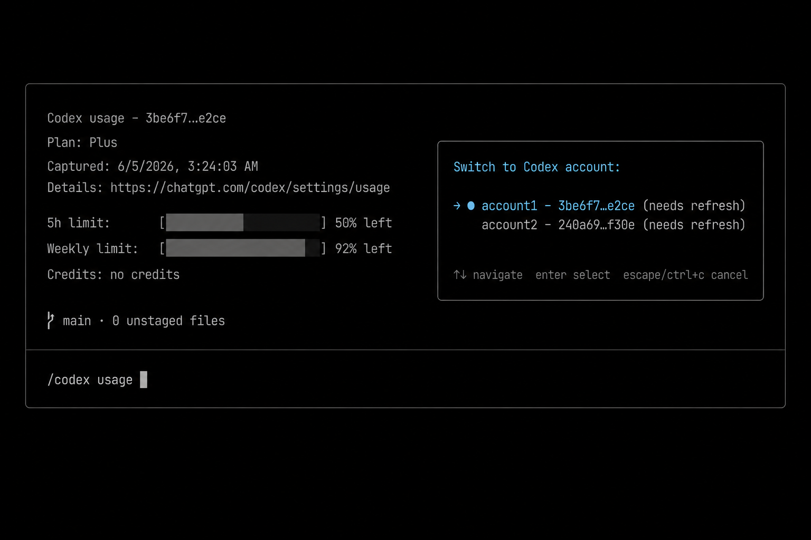

# pi-codex-account

[](https://www.npmjs.com/package/pi-codex-account)
[](https://pi.dev/packages)
[](https://github.com/fadilsflow/pi-codex-account/releases)
[](https://github.com/fadilsflow/pi-codex-account/actions/workflows/ci.yml)
[](LICENSE)

Pi extension for switching between multiple OpenAI Codex OAuth accounts and
checking usage for the active account.

Pi currently stores one `openai-codex` OAuth credential in
`~/.pi/agent/auth.json`. This extension keeps named snapshots of those
credentials in `~/.pi/agent/codex-accounts.json` and swaps the active
credential on demand.

## Features

- Save the current Codex login under a label.
- Switch between saved Codex accounts.
- Show the active account.
- Rename and remove saved accounts.
- Query Codex usage for the active account directly from ChatGPT's usage endpoint.
- No dependency on other usage extensions.
- Does not write usage summaries to the footer/statusline.

## Install

Install the public npm package with Pi:

```bash
pi install npm:pi-codex-account
```

For one-off testing without installing:

```bash
pi -e npm:pi-codex-account
```

For local development from a checkout:

```bash
pi -e /path/to/pi-codex-account
```

After installing or changing the package, reload Pi:

```text
/reload
```

## Commands

```text
/codex
```

Open an interactive account picker.

`/codex-account` is also registered as a backward-compatible alias, but `/codex` is the primary command.

```text
/codex save <label>
```

Save the currently active `openai-codex` credential under a label.

```text
/codex switch <label>
```

Switch the active Codex account to a saved label. The command reloads Pi after writing the credential.

```text
/codex list
/codex current
```

List saved accounts and show the current active account.

```text
/codex usage
```

Fetch usage for the active account and print it in the terminal/notification area. This command does not use another extension.

```text
/codex rename <old> <new>
/codex remove <label>
```

Rename or delete a saved account.

## Typical setup for two accounts

```text
/login openai-codex
/codex save work

/login openai-codex
/codex save personal

/codex switch work
```

## Why `needs refresh` can appear

Pi keeps auth credentials in memory while it is running. When this extension swaps `auth.json`, Pi may still hold the previous credential in memory.

To make Pi pick up the swapped account reliably, the extension writes the selected credential to `auth.json` with `expires: 0`. The next Codex model request sees an expired token, refreshes it with the selected account's refresh token, and re-reads the credential from disk.

Flow:

```text
/codex switch work
send one Codex model request
/codex usage
```

If `/codex usage` says the access token is expired, send one Codex model request first so Pi can refresh the token, then run usage again.

## Security

This extension stores OAuth credential snapshots in:

```text
~/.pi/agent/codex-accounts.json
```

The file is written with permission `0600`, matching Pi's `auth.json` style. It still contains sensitive OAuth tokens. Do not commit it, share it, or copy it to untrusted machines.

## Development

```bash
bun install
bun run typecheck
bun test
```

## Package manifest

This package declares its Pi extension in `package.json`:

```json
{
  "pi": {
    "extensions": ["./src/index.ts"]
  }
}
```

## Limitations

- The extension relies on Pi's existing OAuth refresh path. A first Codex request after switching may be needed to refresh the selected account.
- Usage queries use the active access token directly. If the access token is expired, refresh it via one Codex model request first.
- Credentials are stored on disk, not in macOS Keychain or another encrypted secret store.

## Future upstream improvement

A first-class Pi API for reloading auth storage would remove the need for the `expires: 0` refresh trigger. For example, Pi could expose `ctx.auth.reload()` or `ctx.modelRegistry.reloadAuth()` to extensions.
